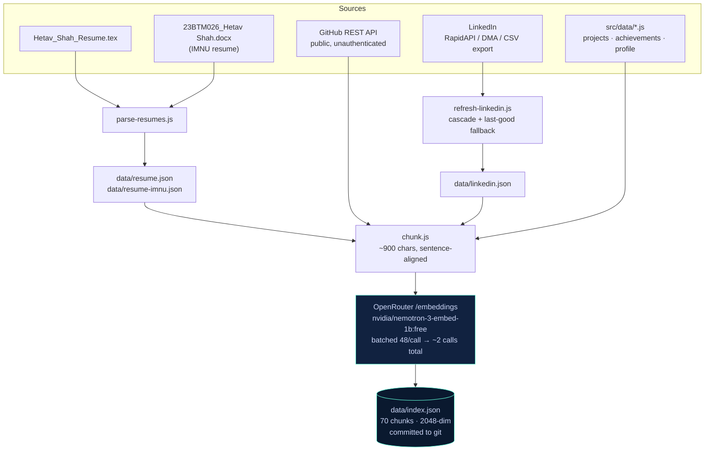
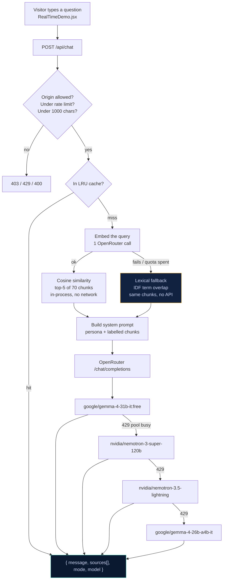
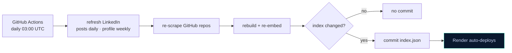

# Hetav Shah — Portfolio

A modern, interactive developer portfolio built with React, Three.js, and Framer Motion — featuring an AI-powered chat agent, dynamic cursor effects, and a fully responsive design.

## 🚀 Key Features

### 🎨 Interactive Experience

- **3D Background**: Three.js-powered animated background with real-time rendering.
- **Resume Aura Cursor**: Custom canvas cursor that emits floating keyword particles (Full-Stack, Agentic, LangGraph, etc.) based on which section you're hovering.
- **Magnetic Buttons**: Buttons that pull toward your cursor with spring physics.
- **Smooth Animations**: Framer Motion transitions on scroll, hover, and page load.
- **Glitch Effect**: Cyberpunk-style name animation in the hero section.

### 🤖 AI Chat Agent

- **Real vector RAG**: The corpus is chunked and embedded ahead of time; each question retrieves the top-5 matching chunks by cosine similarity. Not a fixed blob stuffed into every prompt.
- **Multi-source knowledge base**: Both resumes (`.tex` + IMNU `.docx`), live GitHub repos and READMEs, LinkedIn, and the site's own project/achievement data — 70 chunks, all kept in sync.
- **OpenRouter free tier, end to end**: `nvidia/nemotron-3-embed-1b:free` for embeddings, `google/gemma-4-31b-it:free` for chat. Zero cost.
- **Degrades instead of failing**: if embedding fails, retrieval falls back to lexical IDF scoring over the same chunks; if a model is rate-limited, it fails over to a model on a different provider.
- **Self-updating**: a daily GitHub Action re-scrapes, re-embeds and commits, so new repos and LinkedIn posts show up without any manual step.
- **Conversation memory**: last 12 turns, with an LRU cache so repeat questions cost no quota.

See [architecture_diagram.md](./architecture_diagram.md) for the full pipeline.

### 📂 Sections

- **Hero**: Animated intro with rotating titles (Full-Stack Developer, Agentic AI Engineer, Hackathon Winner).
- **About**: Bio, skills grid, and profile image with animated aura rings.
- **Experience**: Timeline-style work history with detailed bullet points.
- **Achievements**: Hackathon win (1st place), education, and certifications with color-coded cards.
- **Projects**: Featured project cards with golden (VaquaH) and teal (TrafficMind) highlighting, plus all other projects with GitHub/live links.
- **Talk to My Agent**: Live RAG chat agent — retrieval over resumes, GitHub and LinkedIn, on OpenRouter free models.
- **Contact**: Email, phone, and social links with magnetic button interactions.

### 🏆 Featured Projects

- **VaquaH Cooling Service**: Full-stack HVAC/Cooling e-commerce platform — 50+ products, smart search, coupon system, tiered shipping, wishlist, Razorpay & COD checkout, service booking, AMC plans, RAG-powered AI chatbot, hands-free voice assistant, and gesture navigation via MediaPipe.
- **TrafficMind**: 6-agent LangGraph multi-agent system for traffic incident command — parallel fan-out/fan-in orchestration, 250-segment live road network, sub-0.34s response using Groq Llama 3.3 70B, Digital Twin view, DBSCAN hotspot prediction, and voice chat. 1st place, Aetrix 2026 (PDEU).
- **Kontexo**: Agentic MCP gateway — a JSON-RPC 2.0 MCP server exposing 19 tools across GitHub, Slack, Sheets and Trello, driven by a 10-node LangGraph state machine, gated by human approval.
- **FlowPilot**: Agentic AI for autonomous enterprise workflows (Economic Times AI Hackathon 2026) — 6 specialized agents over a LangGraph state graph, 3-tier self-healing recovery, and an immutable audit trail.

## 💻 Tech Stack

**Frontend:**
- React (Vite)
- Tailwind CSS
- Framer Motion (Animations)
- Three.js / React Three Fiber (3D)
- Lucide React (Icons)
- React Intersection Observer

**Backend:**
- Node.js + Express on Render (`server/index.js`) — this is what production runs
- Vercel serverless handler (`api/chat.js`) as an alternative entry point
- Both are thin wrappers over the shared `server/lib/`, so they cannot drift apart
- OpenRouter (embeddings + chat) — the only LLM provider

## 🛠️ Local Development

```bash
# Install dependencies
npm install

# Start development server
npm run dev

# Build for production
npm run build
```

## 🚀 Deployment

The frontend is a static build; the agent runs as an Express service on Render.

See **[RENDER_DEPLOY.md](./RENDER_DEPLOY.md)** for the full walkthrough — it covers which key
goes in which dashboard, which is the easy thing to get wrong (the RapidAPI key belongs in
GitHub Actions, not Render, because the LinkedIn scrape runs in CI).

Quick version:

1. Push to GitHub.
2. Render → new Web Service → root directory `server`, build `npm install`, start `npm start`.
3. Set `OPENROUTER_API_KEY` and `ALLOWED_ORIGINS` in Render's Environment tab.
4. Deploy the static site anywhere, with `VITE_AGENT_API_URL` pointing at the Render URL.
5. Add `OPENROUTER_API_KEY` and `RAPIDAPI_KEY` as GitHub repo secrets to enable the daily refresh.

### Knowledge base commands

```bash
npm run parse:resumes      # .tex + IMNU .docx -> structured JSON
npm run build:index        # chunk + embed -> server/data/index.json (~2 API calls)
npm run refresh:linkedin   # pull latest certifications and posts
npm run check:links        # assert no project link 404s
```

## 🔒 Security

- Environment variables for all API keys; no secrets committed.
- `.env*` is gitignored (broadened from `.env`, so backups and local variants can't leak either).
- Origin allowlist on `/api/chat` via `ALLOWED_ORIGINS` — previously the endpoint accepted any origin.
- Per-IP rate limiting (10/min, 40/day) and a 1,000-character input cap, so the API key can't be drained.
- The GitHub scraper is unauthenticated and public-only, so private repos are structurally unreachable rather than merely filtered.

## 📄 License

All rights reserved. This project is proprietary. Unauthorized use, reproduction, or distribution without explicit permission is strictly prohibited.

---

Built by **Hetav Shah**.

---

## 🏗️ Architecture

The chatbot on this site is a real retrieval-augmented generation pipeline: the corpus is
chunked and embedded ahead of time, and each question is answered from the chunks that
actually match it — not from a fixed blob of text stuffed into every prompt.

Everything runs on **OpenRouter free-tier models**, at zero cost.

### Build time — the knowledge base



The index is **precomputed and committed**. Not because vectors are cheap to store, but
because neither free host can cache one it built: Render's filesystem is ephemeral and the
service spins down after 15 minutes idle, and Vercel functions are read-only with no warm
state. Building at boot would re-embed the whole corpus on every cold start and exhaust the
50-requests/day free quota before a visitor ever asked anything. Reading a committed file is
the one thing both platforms do well.

### Request time — answering a question



Two OpenRouter calls per message: one to embed the query, one to generate. The corpus is
never re-embedded at request time.

**Two independent fallbacks keep it alive.** If embedding fails, retrieval degrades to
lexical scoring over the same chunks rather than going down. If a chat model returns 429 —
which on free tiers usually means that *provider's shared pool* is busy, not that your key is
out of quota — it moves to a model on a different provider. Both Gemma models were observed
rate-limited simultaneously while NVIDIA answered fine.

### Staying current



The repo is public, so Actions minutes are free and unlimited. Post something on LinkedIn or
push a new repo, and the bot can discuss it within a day with no manual step.

### Deployment

| Piece | Runs on | Needs |
| --- | --- | --- |
| Static site | Vercel / any static host | `VITE_AGENT_API_URL` |
| `server/index.js` | Render (free tier) | `OPENROUTER_API_KEY`, `ALLOWED_ORIGINS` |
| `api/chat.js` | Vercel functions (alternative) | same |
| Knowledge refresh | GitHub Actions | `OPENROUTER_API_KEY`, `RAPIDAPI_KEY` |

`server/index.js` and `api/chat.js` are both thin wrappers over `server/lib/` — the same
retrieval, prompt and client code, so the two entry points cannot drift apart.
