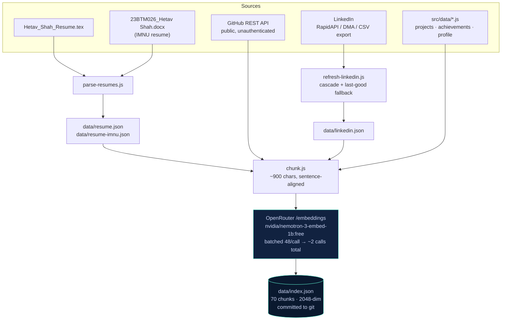
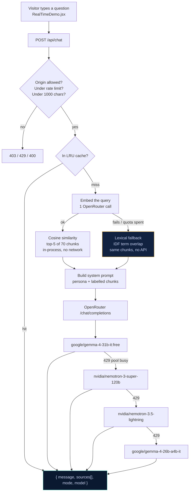
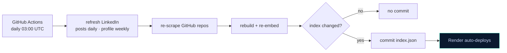

# Portfolio RAG Agent — Architecture

The chatbot on this site is a real retrieval-augmented generation pipeline: the corpus is
chunked and embedded ahead of time, and each question is answered from the chunks that
actually match it — not from a fixed blob of text stuffed into every prompt.

Everything runs on **OpenRouter free-tier models**, at zero cost.

## Build time — the knowledge base

The index is **precomputed and committed**. Not because vectors are cheap to store, but
because neither free host can cache one it built: Render's filesystem is ephemeral and the
service spins down after 15 minutes idle, and Vercel functions are read-only with no warm
state. Building at boot would re-embed the whole corpus on every cold start and exhaust the
50-requests/day free quota before a visitor ever asked anything. Reading a committed file is
the one thing both platforms do well.

## Request time — answering a question

Two OpenRouter calls per message: one to embed the query, one to generate. The corpus is
never re-embedded at request time.

**Two independent fallbacks keep it alive.** If embedding fails, retrieval degrades to
lexical scoring over the same chunks rather than going down. If a chat model returns 429 —
which on free tiers usually means that *provider's shared pool* is busy, not that your key is
out of quota — it moves to a model on a different provider. Both Gemma models were observed
rate-limited simultaneously while NVIDIA answered fine.

## Staying current

The repo is public, so Actions minutes are free and unlimited. Post something on LinkedIn or
push a new repo, and the bot can discuss it within a day with no manual step.

## Deployment

| Piece | Runs on | Needs |
| --- | --- | --- |
| Static site | Vercel / any static host | `VITE_AGENT_API_URL` |
| `server/index.js` | Render (free tier) | `OPENROUTER_API_KEY`, `ALLOWED_ORIGINS` |
| `api/chat.js` | Vercel functions (alternative) | same |
| Knowledge refresh | GitHub Actions | `OPENROUTER_API_KEY`, `RAPIDAPI_KEY` |

`server/index.js` and `api/chat.js` are both thin wrappers over `server/lib/` — the same
retrieval, prompt and client code, so the two entry points cannot drift apart.
